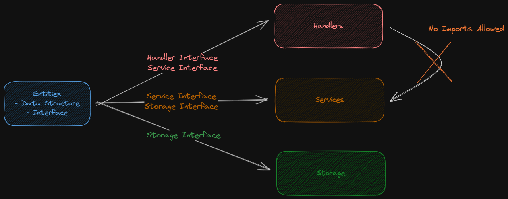

# Architecture

[back to main](../README.md)

This document describes the architecture of the server

## Overview

The server is uses 
- [stk](https://github.com/adharshmk96/stk) to setup the server
- [cobra](https://github.com/spf13/cobra) for cli
- [viper](https://github.com/spf13/viper) for configuration management

The architecture is built around the philosophy of not being dictated by framework or database technologies and to be able to switch them out easily.

The architecture is primarily divided into 3 layers
- handlers
- services
- storage

which are overseen by entities.



These are binded together using dependency injection. The server initialization is where these parts are being bound together.

```go
func setupRoutes(server *stk.Server) {
	userStorage := sqlite.NewAccountStorage()
	userService := services.NewAccountService(userStorage)
	userHandler := handlers.NewAccountHandler(userService)
    ...
}
```

## Responsibility Organization

Routing level ( server )
- binding handler and route
- user authentication and authorization via middlewares

Handler layer
- request validation, parsing and response
- interacting with services

Service layer
- business logic & processing data
- interacting with storage

Storage layer
- preparing and executing queries
- interacting with database


Dependencies are only allowed within these layers (anything from storage shouldn't be imported in handlers or storage), it is considered that the code needs to be shared only within these layers. for eg: services layer may need common functions to within the services layer, but no functions are being imported or exported directly with handlers or storage.

The important parts like datastructures and interfaces are defined in the `entities` section. which can be directly imported by any layer. These layers import the interfaces and implement them and use the datastructures to pass data around.

The dependancy injection ensures that these layers are only bound by interfaces. Thus, we can reuse, (eg) services with a different storage implementation that implements the storage interface.

## Common parts

Common parts like configuration and logger are shared via the `infra` which is also like entities which can be imported anywhere.